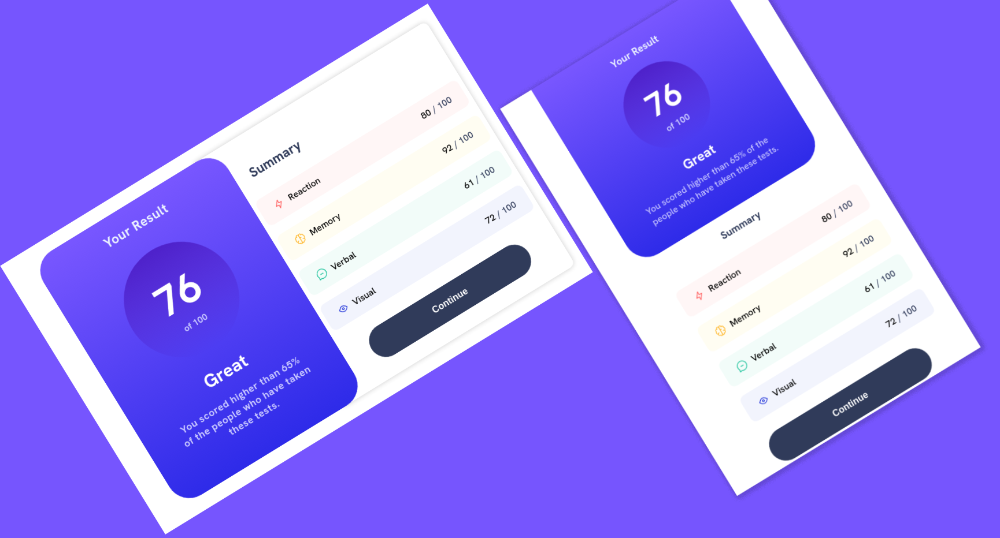

# Frontend Mentor - Results summary component solution

This is a solution to the [Results summary component challenge on Frontend Mentor](https://www.frontendmentor.io/challenges/results-summary-component-CE_K6s0maV). Frontend Mentor challenges help you improve your coding skills by building realistic projects.

## Table of contents

- [Overview](#overview)
  - [The challenge](#the-challenge)
  - [Preview](#Preview)
  - [Links](#links)
- [My process](#my-process)
  - [Built with](#built-with)
  - [What I learned](#what-i-learned)
  - [Continued development](#continued-development)

## Overview

### The challenge

Users should be able to:

- View the optimal layout for the interface depending on their device's screen size
- See hover and focus states for all interactive elements on the page

### Preview

 

### Links

- Solution URL: [Source Code](https://github.com/MrEscappe/results-summary-component-main)
- Live Site URL: [live site URL](https://mrescappe.github.io/results-summary-component-main/)

## My process

### Built with

- Semantic HTML5 markup
- CSS custom properties
- Flexbox
- CSS Grid
- Mobile-first workflow

### What I learned

I learned how to use flex-box and media queries to make the page responsive.

### Continued development

I realy need to improve my skills in CSS. I need to learn how to use CSS Grid and how to make the page responsive to be able to make the page look good on all devices.

## Author

- Website - [José Sérgio](https://github.com/MrEscappe)
